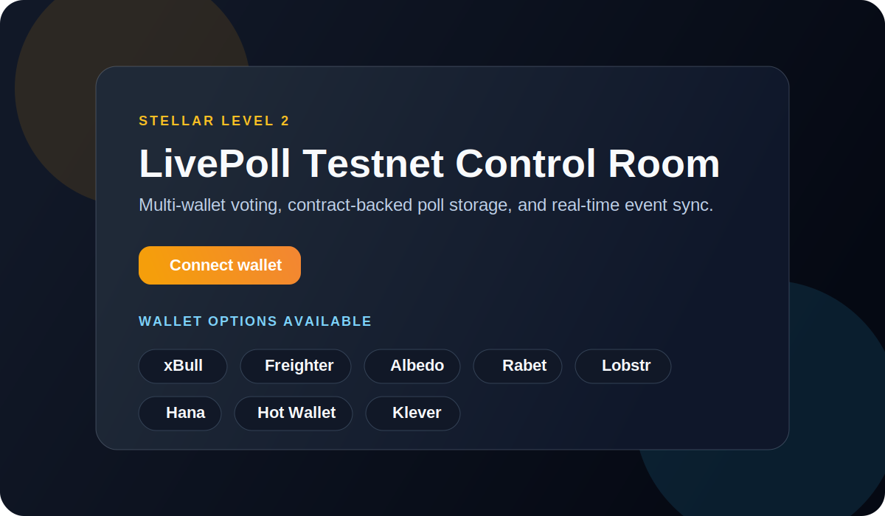

# LivePoll

LivePoll is a Stellar Level 2 submission project: a multi-wallet polling dapp backed by a deployed Soroban smart contract on Stellar Testnet, with real-time contract event sync and visible transaction status updates in the UI.

## Submission Overview

This project demonstrates the required Level 2 skills:

- Multi-wallet integration with `StellarWalletsKit`
- Smart contract deployment on Stellar Testnet
- Contract reads and writes from the frontend
- Real-time event polling and state synchronization
- Visible transaction lifecycle feedback
- Wallet error handling for missing wallet, rejected request, and insufficient balance

## Key Features

- Connect with supported Stellar wallets including Freighter, xBull, Albedo, Rabet, Lobstr, Hana, Hot Wallet, and Klever
- Create, vote on, close, and delete polls through frontend contract calls
- Browse contract data in read-only mode even without a connected wallet
- See transaction phases in the UI: `preparing`, `awaiting-signature`, `pending`, `success`, and `error`
- Refresh poll state automatically from recent on-chain contract events

## Screenshot

Wallet options available:



## Deployed Contract

- Network: `Stellar Testnet`
- Contract address: `CBGJGJOFFSY5KK7DHFENNBGASXROVG5GEW2MISGJ2N2F7VLHCCUJ42UA`
- Contract explorer: https://stellar.expert/explorer/testnet/contract/CBGJGJOFFSY5KK7DHFENNBGASXROVG5GEW2MISGJ2N2F7VLHCCUJ42UA

## Verifiable Contract Call

- Transaction hash: `282d8793c1968e02b32d6d23d688b930a01c316056c908acfd6b685b8089f67e`
- Stellar Expert link: https://stellar.expert/explorer/testnet/tx/282d8793c1968e02b32d6d23d688b930a01c316056c908acfd6b685b8089f67e

## Live Demo

- Optional: add a deployed Vercel, Netlify, or similar link here before final submission

## Setup

Run all commands from the `live-poll` project directory.

1. Install dependencies:

```bash
npm install
```

2. Build the Soroban contract:

```bash
npm run contract:build
```

3. Optionally create a local env file:

```powershell
Copy-Item .env.example .env.local
```

4. Start the frontend:

```bash
npm run dev
```

5. Build for production:

```bash
npm run build
```

## Environment Variables

```env
VITE_STELLAR_RPC_URL=https://soroban-testnet.stellar.org
VITE_STELLAR_NETWORK_PASSPHRASE=Test SDF Network ; September 2015
VITE_STELLAR_CONTRACT_ID=CBGJGJOFFSY5KK7DHFENNBGASXROVG5GEW2MISGJ2N2F7VLHCCUJ42UA
VITE_STELLAR_READ_ACCOUNT=
VITE_STELLAR_EXPLORER_URL=https://stellar.expert/explorer/testnet
```

## Testnet Notes

- A connected wallet must be funded on Stellar Testnet before it can send contract transactions
- If a wallet has not been created on Testnet yet, fund it with Friendbot first and then retry
- The app can still read poll data without a funded wallet by using a temporary read account

## Scripts

- `npm run dev` starts the frontend
- `npm run build` creates a production build
- `npm run lint` runs ESLint
- `npm run contract:build` builds the Soroban contract
- `npm run contract:deploy` uploads and deploys the contract to testnet

## Project Structure

- `src/` contains the React frontend
- `src/lib/stellar.js` contains wallet, RPC, contract, and event helpers
- `poll_contract/` contains the Soroban contract
- `scripts/` contains deployment helpers

## Additional Docs

- Frontend guide: [FRONTEND.md](./FRONTEND.md)
- Contract guide: [poll_contract/README.md](./poll_contract/README.md)

## Submission Notes

- GitHub repository: `https://github.com/Sagar522290/livepoll.git`
- The project includes multiple meaningful commits in git history
- The contract is deployed on testnet and called from the frontend
- Real-time event integration and visible transaction status are implemented
